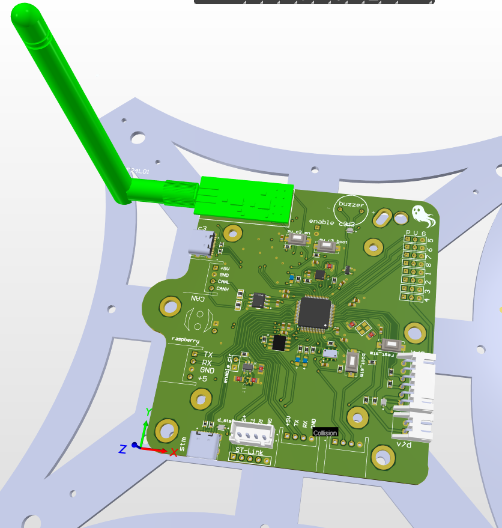
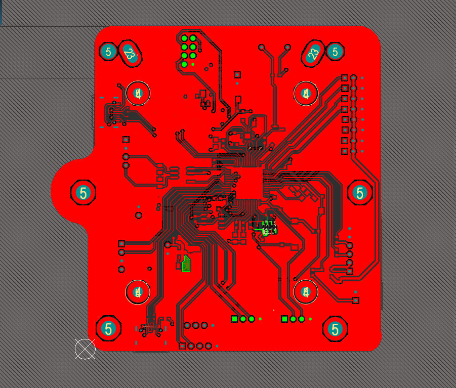
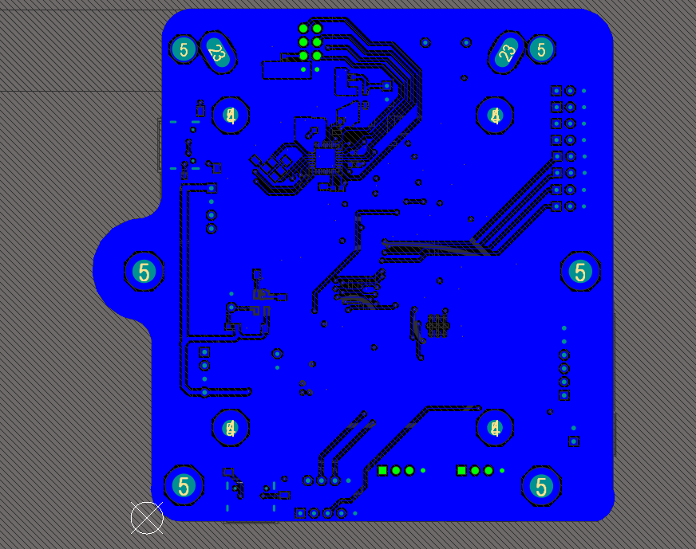

# K-Bee Flight Controller (STM32F405) 🚁

## Overview
The **K-Bee Flight Controller** is a custom-designed hardware flight management system engineered specifically for autonomous drones operating in GPS-denied environments. Designed from the ground up to handle complex navigation tasks, the board integrates seamlessly with companion computers for advanced SLAM (Simultaneous Localization and Mapping) and visual obstacle avoidance.

This repository contains the hardware documentation, schematics, and physical showcases of the board, which successfully runs a custom-compiled ArduCopter firmware.

## Hardware Specifications ⚙️
* **Microcontroller:** STM32F405 Cortex-M4 (168MHz, 1MB Flash)
* **Primary IMU:** MPU9250 (SPI)
* **Backup IMU:** MPU6050 (I2C) - *Providing redundant attitude estimation*
* **Barometer:** BMP085
* **Compass:** HMC5843
* **Telemetry & Comms:** High-speed USART interfaces configured for MAVLink protocols.

## Repository Contents 📁
* 📄 **`Custom STM32F405 Flight Controller.pdf`**: Complete schematic diagram detailing power delivery, MCU routing, and sensor integration.
* 💻 **`3d.png`**: 3D CAD render of the designed PCB.
* 🛠️ **`top.png`** & **`buttom.png`**: Top and Bottom copper routing previews.
* 📸 **`real pcb.jpeg`**: Photograph of the manufactured and assembled printed circuit board.
* 🎥 **`flight controller.gif`**: Demonstration of the board successfully booting and connecting to ArduPilot's Mission Planner.

---

## Showcase Gallery 🖼️

### The Manufactured Board
*The fully assembled custom PCB ready for deployment.*

### CAD & Routing Previews
*Hardware layout and 3D visualization.*

  
  
  

### Firmware Integration & Testing
*Running a custom ArduCopter build. The system successfully boots, calibrates sensors, and establishes a stable MAVLink connection via Mission Planner.*

---

## Firmware Notes 💻
This hardware was brought to life using the **ArduPilot** ecosystem. It utilizes a custom `hwdef.dat` file compiled via the Waf build system to correctly map the microcontroller pinout, initialize the redundant IMUs, and manage memory constraints effectively.
