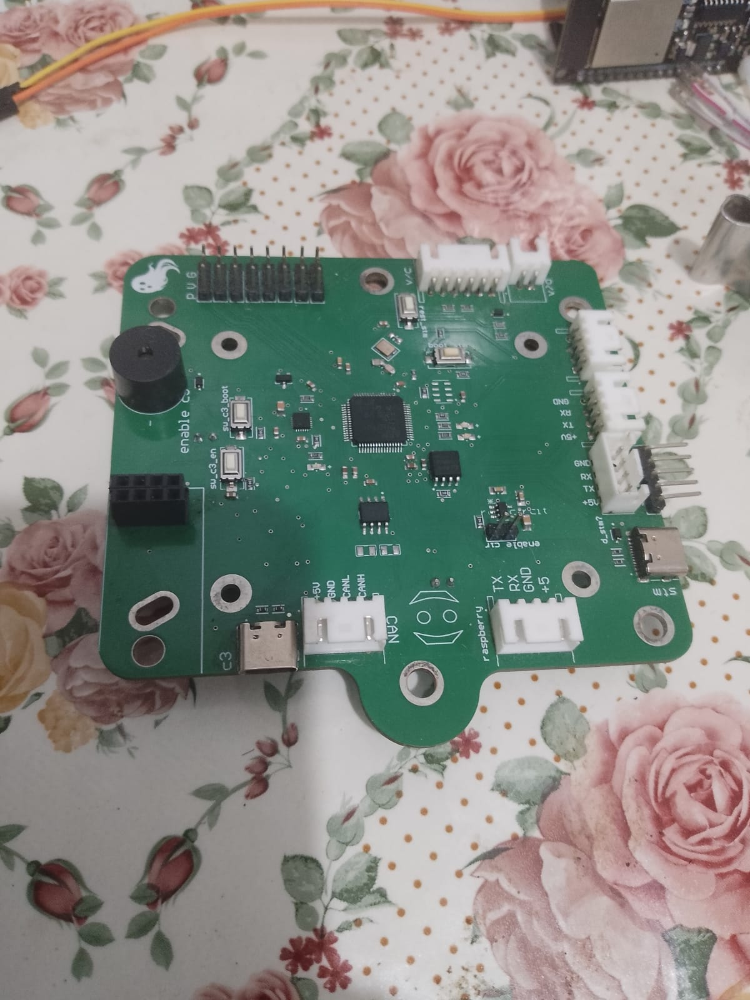

# K-Bee Flight Controller (STM32F405) 🚁

## Overview
The **K-Bee Flight Controller** is a custom-designed hardware flight management system engineered specifically for autonomous drones operating in GPS-denied environments. Designed from the ground up to handle complex navigation tasks, the board integrates seamlessly with companion computers for advanced SLAM (Simultaneous Localization and Mapping) and visual obstacle avoidance.

This repository contains the hardware documentation, schematics, and physical showcases of the board, which successfully runs a custom-compiled ArduCopter firmware.

## Hardware Specifications & Features ⚙️
* **Microcontroller:** STM32F405 Cortex-M4 (168MHz, 1MB Flash).
* **Primary IMU:** MPU9250 (SPI).
* **Backup IMU:** MPU6050 (I2C) - *Providing redundant attitude estimation.*
* **Environment Sensors:** BMP085 (Barometer) and HMC5843 (Compass).
* **Wireless Telemetry:** 
  * Integrated **ESP32-C3** connected via UART.
  * Integrated **NRF** module for robust wireless data transmission.
* **Motor Outputs:** Supports up to **8 motors** intelligently mapped across only **2 Timers**. This specific routing fully supports the high-speed **DShot** protocol (e.g., DShot150/300/600) alongside standard PWM, freeing up other MCU resources.

## Connectivity & I/O Interfaces 🔌
The board is highly extensible and provides several external ports for custom payloads and programming:
* **2x USB Ports:**
  * **STM32 USB:** Direct connection to the main MCU for ArduPilot firmware flashing, Mission Planner configuration, and serial debugging.
  * **ESP32-C3 USB:** Dedicated port for independent programming, debugging, and monitoring of the ESP32-C3 wireless telemetry module.
* **3x UART Ports:**
  * **UART 1 (High-Speed):** Dedicated for companion computers (like Raspberry Pi) to handle heavy SLAM and Vision data via MAVLink.
  * **UART 2 & 3:** Available for auxiliary devices. Successfully tested with a custom-built sensor board that aggregates Ultrasonic and Depth sensor data, feeding it directly to the STM32/ArduPilot via UART.
* **1x CAN Bus:** Ready for external CAN nodes or integrating a CAN-based GPS module if flying in open environments.
* **1x I2C Port:** External I2C access for additional peripherals.

## Repository Contents 📁
* 📄 **`Custom STM32F405 Flight Controller.pdf`**: Complete schematic diagram detailing power delivery, MCU routing, and sensor integration.
* 💻 **`3d.png`**: 3D CAD render of the designed PCB.
* 🛠️ **`top.png`** & **`buttom.png`**: Top and Bottom copper routing previews.
* 📸 **`real pcb.jpeg`**: Photograph of the manufactured and assembled printed circuit board.
* 🎥 **`flight controller.gif`**: Demonstration of the board successfully booting and connecting to ArduPilot's Mission Planner.

---

## Showcase Gallery 🖼️

### The Manufactured Board
*The fully assembled custom PCB ready for deployment.*

  

### CAD & Routing Previews
*Hardware layout and 3D visualization.*

  
  
  

### Firmware Integration & Testing
*Running a custom ArduCopter build. The system successfully boots, calibrates sensors, and establishes a stable MAVLink connection via Mission Planner.*

  

---

## Firmware Notes 💻
This hardware was brought to life using the **ArduPilot** ecosystem. It utilizes a custom `hwdef.dat` file compiled via the Waf build system to correctly map the microcontroller pinout, initialize the redundant IMUs, map the DShot timers, and manage memory constraints effectively.

## Acknowledgements & Team 🎓
The K-Bee Flight Controller is the core hardware foundation of a 2026 engineering graduation project focused on building an Autonomous Drone for GPS-Denied Environments. 

A massive thank you to the technical project team who collaborated across hardware design, computer vision, drone modeling, and control systems engineering to bring this complex system together: Sohaila, Radwa, Soliman, Moamen, Kiro, Abanoub, Reem, Emad, and Daniel.
